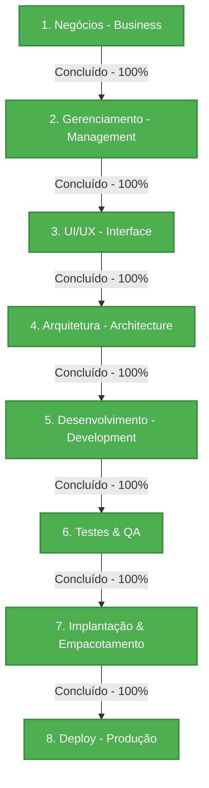

# Status do Workflow de Desenvolvimento - Organizador Pro

Este documento registra formalmente o progresso do desenvolvimento do **Organizador Pro** sob a metodologia **BMAD** (Business, Management, Architecture, Development). Ele atua como o painel de controle de progresso do gerenciamento do projeto.

---

## 1. Visão Geral do Workflow

O projeto do Organizador Pro está estruturado para mitigar riscos de perda ou corrupção de dados físicos em acervos massivos (até 4 TB). Para atingir essa segurança operacional, o workflow segue uma separação rigorosa entre a tomada de decisão lógica (banco de dados SQLite) e a execução física (Workers de movimentação).

---

## 2. Status das Etapas do Workflow

### 🟩 2.1. Etapa de Negócio (Business Layer) — CONCLUÍDA
A fase de alinhamento de escopo, riscos de negócio, métricas de sucesso e governança foi finalizada e aprovada pelo Owner.
* **Marcos Atingidos:**
  - Definição da Visão de Produto e proposição de valor focada em segurança contra corrupção e esgotamento de recursos.
  - Estruturação dos estados lógicos do pipeline ETL (incluindo o estado `quarentena`).
  - Definição das salvaguardas de IA e segurança (blindagem contra Prompt Injection, Path Traversal, mitigação de custo de Tokens e bloqueio absoluto de caminhos de sistema Windows).
  - Estabelecimento da **Política para Arquivos Não-Suportados e Quarentena**: catalogação de metadados + hash SHA-256 e direcionamento para pastas de quarentena física `_QUARENTENA_` com o motivo da falha.
  - Estabelecimento da **Deduplicação Inteligente por Hash xxhash**: prevenção de chamadas LLM e vetorização repetitivas, vinculando arquivos duplicados ao original.
  - Definição da **Regra de Nomenclatura Padrão**: prefixo de data original `[YYYYMMDD]`, sanitização para snake_case e sufixo de homônimos `_v01` a `_v99`.
  - Tratamento apartado de mídias (imagens e vídeos) com a preservação de metadados nativos via APIs do Windows.
* **Entregável:** [visao_negocios.md](file:///c:/Users/Marcelo%20Maymone/Documents/antigravity_projetos/organizador_pro/docs/bmad/1_negocios/visao_negocios.md) validado e assinado pelo Owner.

### 🟩 2.2. Etapa de Interface do Usuário (UI Layer) — CONCLUÍDA
O planejamento de UI/UX e suas especificações de frontend foram consolidados, refinados com base no parecer do analista e aprovados para implementação.
* **Marcos Atingidos:**
  - Definição da interface baseada em Laravel BFF, FilamentPHP e stack TALL.
  - Implementação do widget de progresso dinâmico com Livewire polling de 5 segundos para acompanhamento do motor.
  - Design premium do heatmap de volumes usando *Treemap* do ApexCharts sob política rígida de CSP.
  - Otimização das listagens com paginação estrita e drawer/modal dedicado para controle avançado de duplicatas (propagar, excluir ou criar links simbólicos).
  - Aba de Quarentena detalhada com ferramentas de descarte e reinicialização de registros técnicos falhos.
  - Diretrizes de segurança do Laravel ativas (escape do Blade contra XSS e cabeçalhos de CSP).

### 🟩 2.3. Etapa de Arquitetura (Architecture Layer) — CONCLUÍDA
A especificação estrutural e o fluxo de dados técnico foram planejados, revisados e formalizados com base nos requisitos e princípios SOLID.
* **Marcos Atingidos:**
  - Estruturação técnica do SQLite com DDLs robustas (tabela de processamento contendo chaves de hardware e quarentena, tabela de dispositivos e logs de auditoria).
  - Design Patterns aplicados (SOLID: SRP com workers isolados, OCP com extratores extensíveis baseados em classe abstrata).
  - Fluxo de dados (diagrama de estados e fila baseada no SQLite contemplando o status `quarentena`).
  - Configuração de concorrência e performance SQLite (Modo WAL ativado e Connection Timeout configurado para evitar travamento de escrita entre workers e Laravel).
* **Entregável:** [design_arquitetura.md](file:///c:/Users/Marcelo%20Maymone/Documents/antigravity_projetos/organizador_pro/docs/bmad/3_arquitetura/design_arquitetura.md) e [fluxo_dados.md](file:///c:/Users/Marcelo%20Maymone/Documents/antigravity_projetos/organizador_pro/docs/bmad/3_arquitetura/fluxo_dados.md).

### 🟩 2.4. Etapa de Desenvolvimento — CONCLUÍDA (FASES 1 a 5)

Todas as cinco fases de desenvolvimento foram implementadas, testadas e validadas com 100% de aprovação nos testes automatizados.

#### Fase 1 — Inventário, Hardware ID e Deduplicação (US1) ✅
- Motor Python de varredura recursiva com multithreading implementado.
- Detecção de Hardware ID do drive NTFS via `ctypes` (kernel32) com fallback para `wmic`.
- Registro automático na tabela `dispositivos` e vinculação via `dispositivo_id`.
- Deduplicação lógica por hash xxhash: duplicados inseridos com `eh_duplicado = 1` e status `aguardando_auditoria`, pulando extração e inferência de IA.
- Linter Ruff: 0 warnings. Bandit SAST: 0 issues críticos. SQLFluff: aprovado.

#### Fase 2 — Extração de Texto e Quarentena (US2) ✅
- Extrator PDF com PyMuPDF (primeiras 3 páginas).
- Extrator DOCX com python-docx (limite de 2000 tokens).
- Isolamento de falhas com status `quarentena` e movimentação física para `_QUARENTENA_`.

#### Fase 3 — Classificação Semântica e CoT (US3) ✅
- Classificador de similaridade de cosseno com `sentence-transformers` (modelo multilingual).
- Cascata P.A.R.A. → PCD para classificação macro/micro.
- Integração com LLM para geração de justificativa Chain-of-Thought de 50 palavras.
- Injeção de CoT nas propriedades estendidas do arquivo físico (PDF/Office).

#### Fase 4 — Painel de Auditoria Laravel/FilamentPHP (US4) ✅
- Interface completa com FilamentPHP + Livewire polling 5 segundos.
- Heatmap Treemap com ApexCharts para distribuição por categorias.
- Propagação automática de decisões de aprovação/reclassificação para duplicados via evento Eloquent `updated` no modelo `ArquivoProcessamento`.
- Aba de Quarentena com ações de reinicialização e descarte.
- 6 testes de feature Laravel aprovados (18 assertions).

#### Fase 5 — Execução Física Atômica e Empacotamento (US5) ✅
- Worker de movimentação com `shutil.move()`, hash pós-cópia e rollback transacional.
- Tratamento de colisões por sufixo `_v01` a `_v99`.
- Preservação de metadados de data via `kernel32` no Windows.
- Suite pytest completa: 30 testes passando (incluindo stress test de concorrência).
- Compilação via PyInstaller + orquestrador `start.bat`.

### 🟩 2.5. Auditoria Forense (Modo BMAD Forense) — CONCLUÍDA

Avaliação meticulosa do ecossistema após a implementação das cinco fases. Três falhas críticas detectadas e corrigidas:

| # | Falha Detectada | Correção Aplicada | Status |
|---|-----------------|-------------------|--------|
| 1 | Deduplicação inexistente — todos os arquivos passavam pela IA | Implementada deduplicação por cache de hashes em memória + consulta SQLite no `inventario.py` | ✅ Resolvido |
| 2 | `dispositivo_id` sempre NULL | Implementada detecção de Hardware ID e registro na tabela `dispositivos` | ✅ Resolvido |
| 3 | Duplicados nunca recebiam decisão de aprovação do original | Implementada propagação via Eloquent `booted()` + evento `updated` no Laravel | ✅ Resolvido |

**Entregáveis:** Ver `docs/bmad/4_desenvolvimento/auditoria_forense_*.md`.

### 🟩 2.6. Etapa de Deploy e Produção — CONCLUÍDA ✅

Pacote portátil de produção gerado com sucesso e validado com 9/9 artefatos obrigatórios presentes.

**Entregáveis:**
- `php/` — PHP 8.4.22 portátil NTS x64 (~90 MB), copiado do Laravel Herd. Opera sem instalação global.
- `dist/motor_organizador/` — Motor ETL compilado pelo PyInstaller (~693 MB), autossuficiente.
- `interface_laravel/` — BFF Laravel + FilamentPHP com dependências de produção via Composer (~100 MB).
- `banco_dados/database.sqlite` — Banco inicializado e pronto.
- `start.bat` — Orquestrador portátil v2.0 com detecção automática via `%~dp0`.
- `deploy/empacotar.ps1` — Script PowerShell de empacotamento automatizado (8 etapas).
- `interface_laravel/.env.producao` — Template de `.env` de produção portátil.
- `deploy/producao/docs/PRIMEIROS_PASSOS.md` — Guia de primeira execução.

**Tamanho Total do Pacote:** 883.2 MB

* **Referência:** [deploy/README.md](file:///c:/Users/Marcelo%20Maymone/Documents/antigravity_projetos/organizador_pro/deploy/README.md)

---

## 3. Rastreabilidade das Conversas BMAD

| Conversa | Fase | Assunto Principal |
|----------|------|-------------------|
| `conversa_1_requisitos_e_ux` | B + M | Elicitação de requisitos, personas e critérios de aceite |
| `conversa_2_estruturacao_bmad` | M + A | Estruturação da metodologia e documentação BMAD |
| `conversa_3_planejamento_ui` | A | Planejamento e refinamento da UI/UX com FilamentPHP |
| `4e8dd82e` | D | Correção de erro npm no setup do ambiente |
| `2bf12db3` | D | Verificação de status e alinhamento do backlog |
| `24a39573` | D – US3 | `/grill-me` — Classificação Semântica em Duas Etapas |
| `f7396d7e` | D – US4 | Fase 4: Laravel BFF e FilamentPHP |
| `f6eff5f2` | D – US5 | Fase 5: Execução Física Atômica e Mídias |
| `fbb1e104` | QA | Homologação e Testes de Carga (stress test + SAST) |
| `63085199` | QA + Forense | Auditoria Forense BMAD + Limpeza e Organização do Projeto |
| `f9a67cec` | Deploy | Entrega Final e Deploy Portátil no Volume de 4 TB |

---

## 4. Últimas Atualizações

| Data | Evento |
|------|--------|
| 2026-06-13 | **Deploy Portátil Concluído** — Pacote 883.2 MB gerado com 9/9 artefatos validados |
| 2026-06-13 | PHP 8.4.22 NTS x64 portátil configurado em `php/` (sem instalação global) |
| 2026-06-13 | `start.bat` v2.0 reescrito com portabilidade via `%~dp0` |
| 2026-06-13 | `deploy/empacotar.ps1` criado — automação de 8 etapas de empacotamento |
| 2026-06-13 | Auditoria Forense concluída — 3 falhas críticas corrigidas |
| 2026-06-13 | Stress Test e Homologação: 30 testes pytest + 6 feature tests Laravel aprovados |
| 2026-06-13 | Limpeza e organização do diretório conforme metodologia BMAD |
| 2026-06-13 | Pasta `deploy/producao/` criada e estruturada para o deploy |
