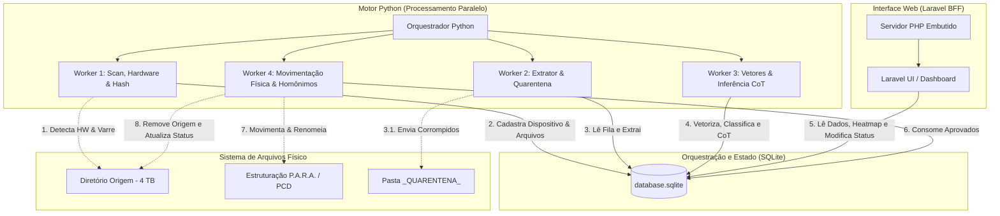

# Especificação de Arquitetura de Software - Organizador Pro

Esta especificação arquitetural define as decisões técnicas estruturais do Organizador Pro com base nos princípios SOLID, desacoplamento e portabilidade.

---

## 1. Princípios SOLID Aplicados

Para garantir manutenibilidade e extensibilidade sem que modificações quebrem o comportamento existente:

### SRP - Single Responsibility Principle (Princípio da Responsabilidade Única)
* **Motor de Filas SQLite:** O banco de dados centraliza e expõe exclusivamente o estado da aplicação e das filas.
* **Workers de Processo (Python):** Cada worker do multiprocessamento possui uma responsabilidade única:
  - `ScanWorker`: Apenas identifica o hardware ID, varre o diretório respeitando bloqueios preventivos de caminhos do SO, calcula o hash SHA-256 e registra no banco.
  - `ExtractWorker`: Apenas extrai textos de documentos no limite de tokens, redirecionando falhas físicas de leitura para a quarentena.
  - `InferenceWorker`: Apenas calcula embeddings de similaridade de cosseno e gera a justificativa CoT via LLM.
  - `MovementWorker`: Apenas executa a movimentação física dos arquivos no sistema (incluindo tratamento de homônimos e mídias dedicadas).

### OCP - Open/Closed Principle (Princípio do Aberto/Fechado)
* **Interface de Extração Extensível:** A extração de texto utiliza uma classe base abstrata `BaseExtractor`. Novos formatos de arquivo (ex: HTML, Markdown) podem ser adicionados criando uma nova classe derivada sem modificar a rotina principal de orquestração do `ExtractWorker`.

### LSP - Liskov Substitution Principle (Princípio da Substituição de Liskov)
* **Substitutabilidade de Extratores:** Qualquer subclasse de `BaseExtractor` (ex: `PdfExtractor`, `DocxExtractor`) pode substituir o objeto base sem alterar a corretude do pipeline do worker, pois todas cumprem rigorosamente a assinatura de extração contratada.

### ISP - Interface Segregation Principle (Princípio da Segregação de Interfaces)
* **Contratos Enxutos:** Os componentes de código consomem apenas as funções das bibliotecas necessárias. Por exemplo, o script de auditoria do front-end PHP/Laravel (BFF) comunica-se exclusivamente com o SQLite para leitura e modificação do status lógico, sem conhecer a API de ML de embeddings ou os workers físicos.

### DIP - Dependency Inversion Principle (Princípio da Inversão de Dependência)
* **Serviços de IA Desacoplados:** O motor de inferência depende de uma abstração de LLM (`BaseLlmService`). A implementação concreta pode alternar entre uma API remota (OpenAI, Gemini) e um modelo local (llama-cpp-python) sem alterar a classe orquestradora da inferência.

---

## 2. Diagrama de Componentes e Processos



---

## 3. Esquema Físico do SQLite (DDL)

Para manter a simplicidade portátil no Windows 11 sem dependências de infraestrutura complexas, o SQLite atua como repositório de estado e fila de transição de status.

```sql
-- Tabela para gerenciar os dispositivos de hardware físicos mapeados
CREATE TABLE IF NOT EXISTS dispositivos (
    hw_id TEXT PRIMARY KEY, -- Identificador único de hardware do host/drive
    label TEXT NOT NULL,    -- Nome amigável atribuído pelo usuário (ex: "BKP_Externo_2025")
    data_cadastro TIMESTAMP DEFAULT CURRENT_TIMESTAMP
);

-- Tabela principal de controle do pipeline ETL
CREATE TABLE IF NOT EXISTS arquivos_processamento (
    id INTEGER PRIMARY KEY AUTOINCREMENT,
    hw_id TEXT, -- Relacionamento com o hardware físico de origem
    caminho_origem TEXT NOT NULL UNIQUE,
    nome_arquivo TEXT NOT NULL,
    extensao TEXT NOT NULL,
    tamanho_bytes INTEGER NOT NULL,
    hash_sha256 TEXT NOT NULL,
    eh_duplicado BOOLEAN DEFAULT 0, -- Indica se é um arquivo duplicado logicamente
    original_id INTEGER, -- ID do arquivo original de referência (mesmo hash)
    data_descoberta TIMESTAMP DEFAULT CURRENT_TIMESTAMP,
    
    -- Controle de Fila e Estados do Pipeline
    -- Estados: pendente_extracao, pendente_inferencia, aguardando_auditoria, aprovado_para_movimentacao, quarentena, concluido, erro
    status TEXT NOT NULL DEFAULT 'pendente_extracao', 
    mensagem_erro TEXT, -- Stack trace em caso de falha de script ou ML
    motivo_falha TEXT,  -- Explicação legível para quarentena (ex: "Arquivo corrompido")
    
    -- Metadados e Enriquecimento Semântico
    texto_extraido TEXT,
    vetor_embedding BLOB, -- Vetor compactado ou serializado
    categoria_macro TEXT, -- Projects, Areas, Resources, Archives (P.A.R.A.)
    categoria_micro TEXT, -- Código/Subcategoria PCD
    similaridade_calculada REAL, -- Cosseno da similaridade
    justificativa_cot TEXT, -- Texto explicativo da LLM (Chain of Thought)
    
    -- Caminho Físico Final Decidido
    caminho_destino_sugerido TEXT,
    caminho_destino_aprovado TEXT,
    data_processamento TIMESTAMP,
    data_movimentacao TIMESTAMP,
    
    FOREIGN KEY (hw_id) REFERENCES dispositivos(hw_id) ON DELETE SET NULL,
    FOREIGN KEY (original_id) REFERENCES arquivos_processamento(id) ON DELETE SET NULL
);

-- Índices para otimização de Fila, Deduplicação e Buscas
CREATE INDEX IF NOT EXISTS idx_arquivos_status ON arquivos_processamento (status);
CREATE INDEX IF NOT EXISTS idx_arquivos_hash ON arquivos_processamento (hash_sha256);
CREATE INDEX IF NOT EXISTS idx_arquivos_origem ON arquivos_processamento (caminho_origem);
CREATE INDEX IF NOT EXISTS idx_arquivos_hw_id ON arquivos_processamento (hw_id);

-- Tabela para gerenciar a taxonomia dinâmica e caminhos permitidos do P.A.R.A. / PCD
CREATE TABLE IF NOT EXISTS categorias_destino (
    id INTEGER PRIMARY KEY AUTOINCREMENT,
    categoria_macro TEXT NOT NULL, -- Projects, Areas, Resources, Archives
    categoria_micro TEXT NOT NULL UNIQUE, -- Código/Subcategoria PCD (ex: apostilas, manuais)
    caminho_relativo_pasta TEXT NOT NULL, -- Caminho relativo dentro do destino (ex: Resources/apostilas)
    descricao_busca TEXT NOT NULL, -- Descrição semântica para cálculo de embeddings
    vetor_embedding BLOB, -- Embedding pré-calculado da descrição em formato binário
    data_criacao TIMESTAMP DEFAULT CURRENT_TIMESTAMP
);

-- Tabela para auditoria e log de execução de componentes
CREATE TABLE IF NOT EXISTS logs_processamento (
    id INTEGER PRIMARY KEY AUTOINCREMENT,
    arquivo_id INTEGER,
    componente TEXT NOT NULL, -- Ex: ScanWorker, ExtractWorker, InferenceWorker, UI
    nivel TEXT NOT NULL, -- INFO, WARNING, ERROR, CRITICAL
    mensagem TEXT NOT NULL,
    data_log TIMESTAMP DEFAULT CURRENT_TIMESTAMP,
    FOREIGN KEY (arquivo_id) REFERENCES arquivos_processamento(id) ON DELETE SET NULL
);
```

---

## 4. Otimização de Concorrência e Performance no SQLite

O SQLite opera por padrão em modo de concorrência restrito. Para evitar erros do tipo `database is locked` (`SQLITE_BUSY`) devido a acessos de escrita simultâneos dos múltiplos workers Python e do servidor PHP/Laravel (BFF), as seguintes diretrizes são obrigatórias na inicialização da conexão:

### Habilitação do modo WAL (Write-Ahead Logging)
Ao abrir a conexão com o banco em qualquer componente, deve-se executar o comando:
```sql
PRAGMA journal_mode=WAL;
```
Isso permite que leitores leiam o banco simultaneamente enquanto um escritor está gravando alterações, aumentando drasticamente a vazão de concorrência e evitando bloqueios mútuos.

### Timeout e Tratamento de Busy
Configurar um timeout de conexão de pelo menos 30 segundos (`sqlite3.connect('database.sqlite', timeout=30.0)` em Python e configurações equivalentes no driver PDO do Laravel), para que as requisições de escrita aguardem a liberação do lock em vez de falharem imediatamente.
