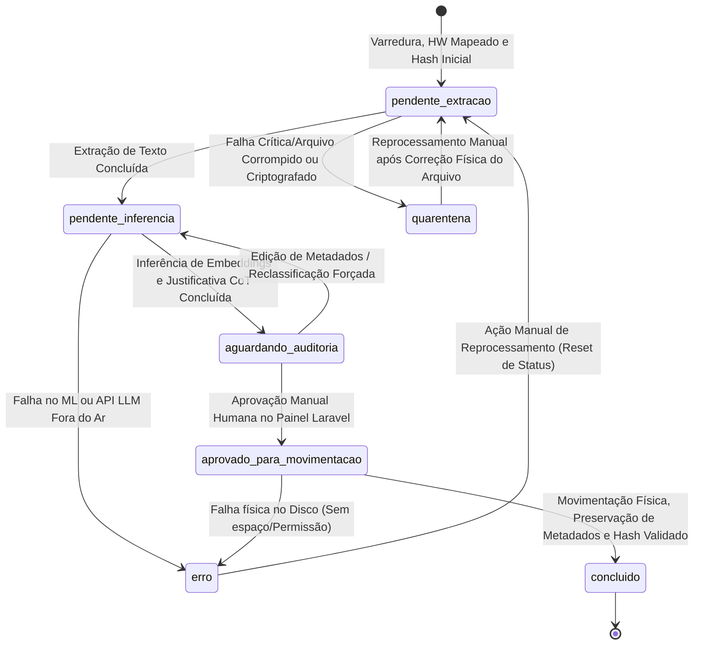

# Fluxo de Dados e Ciclo de Vida dos Arquivos - Organizador Pro

Este documento descreve detalhadamente como os dados trafegam pela aplicação desde a descoberta de um arquivo físico no sistema de arquivos até sua movimentação final, organização física e auditoria lógica.

---

## 1. Diagrama de Transição de Estados (Ciclo de Vida do Registro)

---

## 2. Passo a Passo Técnico do Pipeline ETL

### 2.1. Fase de Extração (E)
1. **Varredura Paralela e Mapeamento de Hardware:** O motor Python detecta o Identificador Físico Único do disco hospedeiro/drive externo (salvando na tabela `dispositivos` com um label customizado) e executa `os.scandir()` recursivo no diretório raiz indicado de origem. A varredura respeita o bloqueio absoluto de caminhos de sistema Windows.
2. **Cálculo de Hash (SHA-256) e Registro Inicial:** O arquivo é processado para obtenção de seu hash SHA-256 inicial:
   * **Deduplicação Inteligente:** Se o hash **já** existir no SQLite para o mesmo dispositivo de hardware, o arquivo atual é marcado com `eh_duplicado = 1` e seu `original_id` é apontado para o ID do primeiro arquivo descoberto. O status do duplicado pula para `aguardando_auditoria` diretamente.
   * Se o hash **não** existir no SQLite: O arquivo é cadastrado como original de referência, recebendo o status `pendente_extracao`.
3. **Extração de Conteúdo e Quarentena:**
   * **Arquivos de Texto Suportados (.pdf, .docx):** O `ExtractWorker` lê as primeiras 3 páginas ou até o limite rígido de 2000 tokens e insere o conteúdo limpo na coluna `texto_extraido`, avançando o status para `pendente_inferencia`.
   * **Arquivos Não-Suportados Semânticos:** Binários, executáveis ou mídias não sofrem extração de texto profundo. A coluna `texto_extraido` permanece `NULL` e o status avança diretamente para `pendente_inferencia`.
   * **Quarentena Física:** Arquivos fisicamente corrompidos, inacessíveis por bloqueio de permissão de leitura ou criptografados sem suporte serão movidos fisicamente para a pasta `_QUARENTENA_` na raiz do *destino*, preservando suas subpastas de origem. O status no SQLite muda para `quarentena` acompanhado do detalhamento do erro na coluna `motivo_falha`.

### 2.2. Fase de Transformação (T)
1. **Geração de Embeddings e Roteamento em Cascata:** O `InferenceWorker` processa os arquivos originais com status `pendente_inferencia`:
   * **Arquivos Suportados:** Calcula o embedding do texto extraído utilizando o modelo `paraphrase-multilingual-MiniLM-L12-v2` e executa a classificação de similaridade de cosseno em duas etapas:
     1. **Passo Macro:** Roteia entre as categorias principais da metodologia P.A.R.A. (*Projects*, *Areas*, *Resources*, *Archives*).
     2. **Passo Micro:** Compara o vetor do arquivo estritamente contra as subpastas cadastradas da categoria macro correspondente no Plano de Classificação de Documentos (PCD).
   * **Arquivos Não-Suportados:** O classificador pula a vetorização e mapeia o arquivo para uma categoria genérica padrão (ex: `Archives/Outros` ou correspondente à extensão).
2. **Chain of Thought (CoT) e Injeção de Metadados:**
   * O motor passa os 2000 tokens extraídos e a categoria recomendada ao LLM para geração da justificativa de 50 palavras explicativa da tomada de decisão.
   * **Injeção Física:** Se ativado e suportado pelo formato de arquivo (ex: PDFs e Office), o motor Python injeta fisicamente a justificativa CoT nos metadados estendidos do arquivo.
   * Para arquivos não-suportados, a justificativa gravada é padrão: *"Formato de arquivo não textual. Classificado automaticamente em categoria geral para governança e auditoria manual."*
3. **Persistência Lógica:** Os resultados são salvos no SQLite e o status é alterado para `aguardando_auditoria`.

### 2.3. Fase de Carga (L)
1. **Auditoria Humana no Painel Laravel (BFF):** O painel web renderiza os arquivos prontos de forma paginada para evitar estouros de RAM (OOM), incluindo uma visualização em heatmap por categorias.
2. **Propagação Automática de Decisões:** Ao aprovar ou alterar o destino sugerido de um arquivo **Original** na interface:
   * O Laravel BFF propaga de forma automática a mesma decisão (caminho final de destino e status `aprovado_para_movimentacao`) para todos os registros dependentes vinculados ao mesmo `original_id` (duplicados de mesmo hash).
   * O usuário pode optar na interface por marcar os duplicados adicionais para exclusão física.
3. **Movimentação Atômica e Tratamento de Homônimos:** O `MovementWorker` consome os registros `aprovado_para_movimentacao`:
   * **Tratamento Especial de Mídias:** Se o arquivo for uma mídia (imagem/vídeo), ele é direcionado para as subpastas `imagens` ou `vídeos` correspondentes e as APIs nativas do Windows são acionadas para preservar integralmente a data original de criação física nos metadados.
   * **Tratamento de Homônimos:** Se houver colisão de nomes no diretório físico de destino, o worker renomeará o arquivo adicionando sufixos incrementais (`_v01` a `_v99`).
   * **Renomeação Geral:** Todos os arquivos válidos são renomeados para o padrão `[YYYYMMDD]_[nome_original_snake_case].[ext]`, evitando duplicar o prefixo de data se ele já constar na origem.
4. **Verificação de Integridade e Teardown Físico:**
   * O worker recalcula o hash SHA-256 no destino. Se idêntico ao original, o arquivo de origem correspondente é apagado e o status muda para `concluido`.
   * **Teardown In-Place:** Se a operação for na mesma árvore (Origem = Destino), após a conclusão da carga de todos os arquivos do lote, o worker executa uma varredura recursiva de limpeza, excluindo fisicamente todos os diretórios vazios remanescentes.
