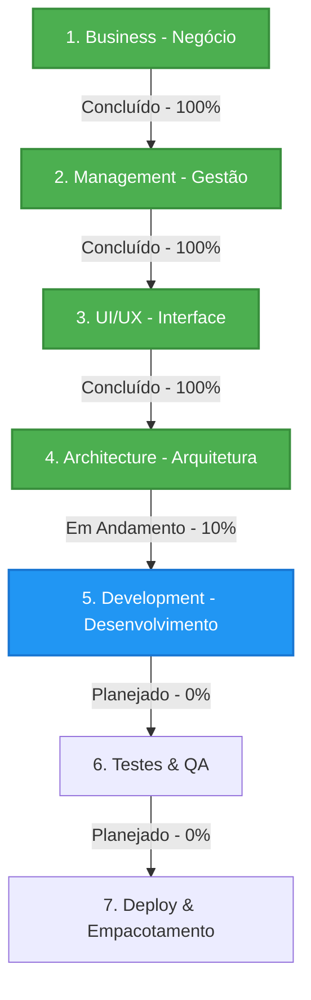

# Status do Workflow de Desenvolvimento - Organizador Pro

Este documento registra formalmente o progresso do desenvolvimento do **Organizador Pro** sob a metodologia **BMAD** (Business, Management, Architecture, Development). Ele atua como o painel de controle de progresso do gerenciamento do projeto.

---

## 1. Visão Geral do Workflow

O projeto do Organizador Pro está estruturado para mitigar riscos de perda ou corrupção de dados físicos em acervos massivos (até 4 TB). Para atingir essa segurança operacional, o workflow segue uma separação rigorosa entre a tomada de decisão lógica (banco de dados SQLite) e a execução física (Workers de movimentação).

---

## 2. Status das Etapas do Workflow

### 🟩 2.1. Etapa de Negócio (Business Layer) - CONCLUÍDA
A fase de alinhamento de escopo, riscos de negócio, métricas de sucesso e governança foi finalizada e aprovada pelo Owner.
* **Marcos Atingidos:**
  * Definição da Visão de Produto e proposição de valor focada em segurança contra corrupção e esgotamento de recursos.
  * Estruturação dos estados lógicos do pipeline ETL (de `pendente_extracao` a `concluido`).
  * Definição das salvaguardas de IA e segurança (blindagem contra Prompt Injection, Path Traversal, mitigação de custo computacional/Tokens).
  * Estabelecimento da **Política para Arquivos Não-Suportados**: catalogação de metadados + hash SHA-256 e direcionamento para categorias de refugo/gerais com justificativa padrão.
  * Estabelecimento da **Deduplicação Inteligente por Hash SHA-256**: prevenção de chamadas LLM e vetorização repetitivas, vinculando arquivos duplicados ao original.
* **Entregável:** [business_vision.md](file:///c:/Users/Marcelo%20Maymone/Documents/antigravity_projetos/organizador_pro/docs/bmad/1_business/business_vision.md) validado e assinado pelo Owner.

### 🟩 2.2. Etapa de Interface do Usuário (UI Layer) - CONCLUÍDA (PLANEJAMENTO)
As diretrizes e a especificação técnica de desenvolvimento para a UI em Laravel (BFF) foram integradas à documentação de desenvolvimento. A interface utilizará o ecossistema FilamentPHP e a stack TALL.
* **Marcos Atingidos:**
  * Definição da interface web baseada no ecossistema FilamentPHP e stack TALL.
  * Estabelecimento do Laravel como Backend For Frontend (BFF) isolado, consumindo a API Python indiretamente por meio do banco SQLite.
  * Modelagem de listagens rápidas com paginação estrita no SQLite para evitar estouro de memória (OOM).
  * Lógica de auditoria assíncrona (Polling/Livewire) para exibir status do ETL sem travar a interface.
  * Diretrizes de segurança integradas (isolamento de credenciais no `.env`, proteção XSS e Content Security Policy).
  * **Propagação de Decisões de Duplicados:** Design de interface que permite propagar de forma automática a decisão de movimentação do arquivo original de referência para todos os seus duplicados (com o mesmo hash), otimizando a auditoria.
* **Próximos Passos:** Criação do ambiente base do Laravel com as dependências do FilamentPHP na fase de Desenvolvimento.

### 🟩 2.3. Etapa de Arquitetura (Architecture Layer) - CONCLUÍDA (PLANEJAMENTO)
A especificação estrutural e o fluxo de dados técnico foram planejados, revisados e formalizados com base nos requisitos e princípios SOLID.
* **Marcos Atingidos:**
  * Estruturação técnica do SQLite com DDLs robustas (tabela de processamento, logs de auditoria e categorias de destino dinâmicas).
  * Design Patterns aplicados (SOLID: SRP com workers isolados, OCP com extratores extensíveis baseados em classe abstrata).
  * Fluxo de dados (diagrama de estados e fila baseada no SQLite).
  * Configuração de concorrência e performance SQLite (Modo WAL ativado e Connection Timeout configurado para evitar travamento de escrita entre workers e Laravel).
* **Próximos Passos:** Prosseguir para o setup e desenvolvimento dos serviços isolados no Laravel.

### 🟧 2.4. Etapa de Desenvolvimento e Testes (Development & QA Layer) - EM ANDAMENTO
Com o planejamento de UI e Arquitetura concluídos e aprovados, a fase de desenvolvimento técnico foi desbloqueada.
* **Atividades em Andamento:**
  * Integração de diretrizes de desenvolvimento do front-end na especificação técnica.
  * Setup das ferramentas de qualidade estática (Ruff, Bandit e SQLFluff) e configuração das variáveis de ambiente locais.
* **Próximos Passos:** Setup do repositório/estrutura física do Laravel e Python, inicialização do `.env` e criação dos testes iniciais com Mock de IA e Teardown robusto.

---

## 3. Próximas Atividades de Gestão (Management Plan)

1. **Setup de Ambiente de Desenvolvimento:** Criar arquivos de configuração locais (`pyproject.toml`, `.ruff.toml`, etc.) para garantir o funcionamento das barreiras de qualidade estática.
2. **Inicialização das Estruturas:** Gerar a estrutura inicial da pasta `interface_laravel/` (Laravel) e `motor_python/` (Python) com os ambientes virtuais correspondentes.
3. **Criação do Banco de Dados Local:** Rodar las DDLs e sementes iniciais para validar a concorrência WAL localmente.
