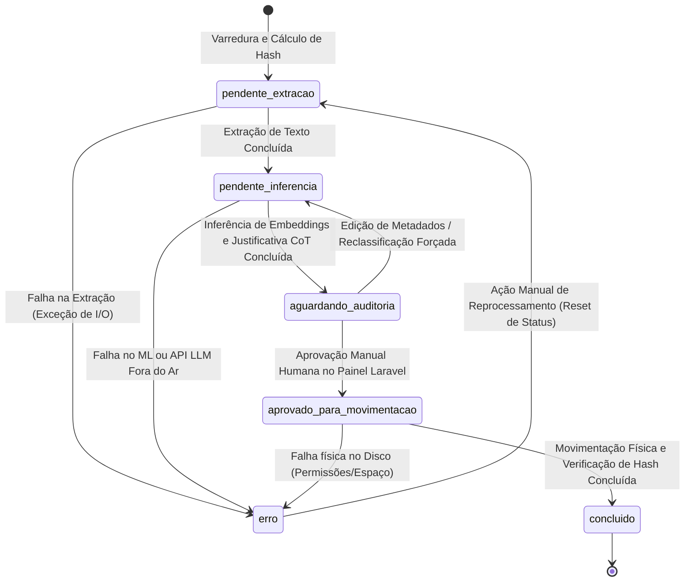

# Fluxo de Dados e Ciclo de Vida dos Arquivos - Organizador Pro

Este documento descreve detalhadamente como os dados trafegam pela aplicação desde a descoberta de um arquivo físico no sistema de arquivos até sua movimentação final e auditoria lógica.

---

## 1. Diagrama de Transição de Estados (Ciclo de Vida do Registro)

---

## 2. Passo a Passo do Pipeline ETL

### Fase de Extração (E)
1. **Varredura Paralela:** O motor Python invoca `os.scandir()` no diretório raiz indicado de origem. O script opera de forma não-bloqueante no Windows 11.
2. **Registro Inicial:** Cria-se o registro no SQLite com status `pendente_extracao`.
3. **Cálculo de Hash (SHA-256) e Deduplicação:** O arquivo é processado para obter seu hash SHA-256.
   * Se o hash **não** existir no SQLite: O arquivo é o original de referência.
   * Se o hash **já** existir no SQLite: O arquivo atual é marcado com `eh_duplicado = 1` e `original_id` é preenchido com o ID do primeiro arquivo cadastrado com aquele hash. O status desse arquivo duplicado pula a extração e a inferência, mudando diretamente para `aguardando_auditoria`.
4. **Governança de Formatos de Arquivo (Extração):**
   * **Arquivos de Texto Suportados (.pdf, .docx):** O `ExtractWorker` lê o arquivo nos limites de tamanho (primeiras 3 páginas ou 2000 tokens) e insere o texto limpo na coluna `texto_extraido`. O status muda para `pendente_inferencia`.
   * **Arquivos Não-Suportados (mídia, compactados, binários):** O `ExtractWorker` pulará a leitura de texto. O registro é salvo com `texto_extraido = NULL` e o status passa diretamente para `pendente_inferencia`.

### Fase de Transformação (T)
1. **Geração de Embeddings:** O `InferenceWorker` lê os registros em `pendente_inferencia`.
2. **Cálculo de Similaridade (Cosseno):**
   * **Arquivos de Texto:** Calcula o embedding do texto extraído e compara via similaridade de cosseno contra os vetores de descrição das categorias carregadas de `categorias_destino` (Fase P.A.R.A. e PCD).
   * **Arquivos Não-Suportados:** O classificador não faz vetorização textual. O arquivo é sugerido para uma categoria genérica de refugo (ex: `Archives/Outros` ou correspondente) com base em sua extensão ou metadados simples.
3. **Chain of Thought (CoT):**
   * **Arquivos de Texto:** O texto extraído e a categoria recomendada são enviados para a LLM para geração da justificativa de 50 palavras explicando a decisão.
   * **Arquivos Não-Suportados:** O sistema grava uma justificativa padrão: *"Formato de arquivo não textual. Classificado automaticamente em categoria geral para governança e auditoria manual."*
4. **Persistência Lógica:** O status é alterado para `aguardando_auditoria`.

### Fase de Carga (L)
1. **Validação Humana e Propagação (Auditoria):** O painel web Laravel exibe a lista de arquivos prontos. O usuário revisa as sugestões com base na justificativa textual (CoT).
   * Ao aprovar ou alterar o destino de um arquivo **Original**: O Laravel propaga automaticamente a mesma decisão (caminho de destino aprovado e status `aprovado_para_movimentacao`) para todos os registros dependentes com o mesmo `original_id`, otimizando a governança em lotes de duplicados.
   * O painel Laravel também oferece uma opção de "Descartar Duplicados", que marca os registros duplicados para exclusão física em vez de movimentação.
2. **Movimentação Atômica:** O `MovementWorker` busca registros com status `aprovado_para_movimentacao` no SQLite. Ele cria os diretórios físicos finais necessários e executa `shutil.move()` ou `os.rename()`.
3. **Verificação Pós-Movimentação:** O worker recalcula o hash SHA-256 no destino. Se os hashes baterem, o arquivo de origem correspondente é deletado e o status muda para `concluido`. Caso ocorra falha (permissões, disco cheio), a operação física é desfeita (se aplicável), o status muda para `erro` e a mensagem de erro é persistida no banco.
